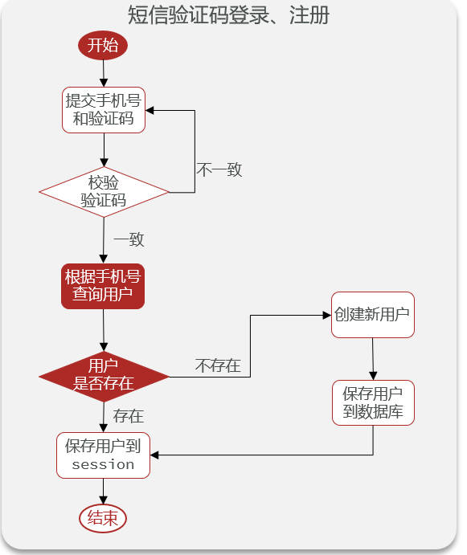
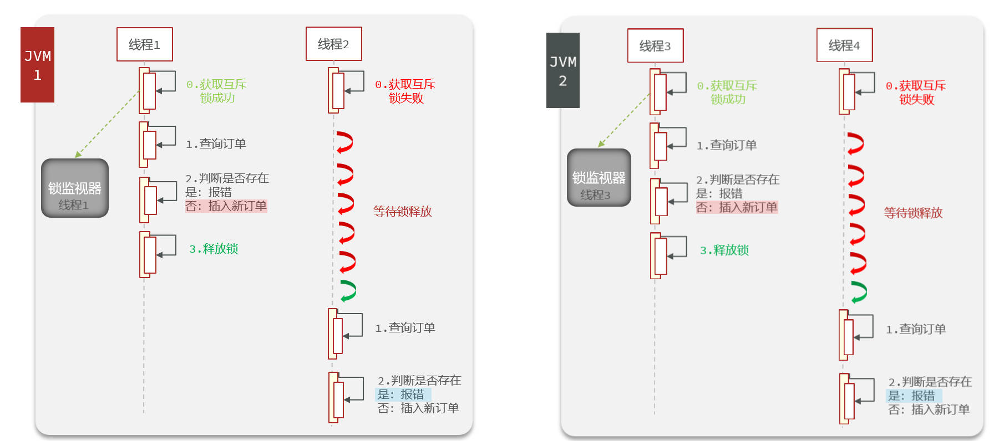
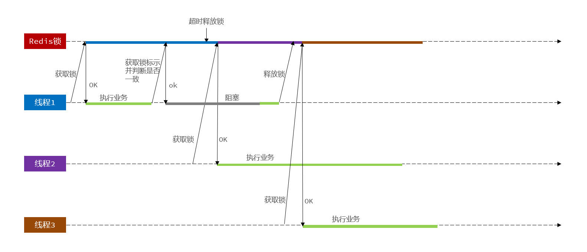

# 黑马点评项目

## 1. 基于Redis的短信登录

### 1.1 基于Session的登录流程

#### 发送短信验证码

- 接口：`/user/code`

- 流程：


#### 短信验证码登录、注册

- 接口：`/user/login`

- 流程：



#### 校验登录状态（使用拦截器进行校验）

- 流程：


#### 基于Session登录的问题

- 多台Tomcat并不共享session存储空间，当请求切换到不同tomcat服务时导致数据丢失问题

### 1.2 基于Redis实现共享登录

#### 发送短信验证码

- 流程

  

#### 短信验证码登录、注册

- 流程

  
  
  - 前端会将登录的token保存到session
  
    

### 1.3 技术细节

#### 依赖注入问题


`RefreshTokenInterceptor`的实例是通过`new`的方式配置在拦截器配置类中，所以不能使用`@Autowired`或`@Resourcs`进行依赖注入

#### 拦截器设置和配置


- 配置两个拦截器
  - 第一个拦截器拦截**所有路径**，主要功能为：刷新token的有效期，并将当前用户保存到`ThreadLocal`中；均放行；
  - 第二个拦截器拦截**需要登录校验的路径**，主要功能为：进行登录校验，即判断当前`ThreadLocal`中是否有用户信息；
  - 两个拦截器的顺序可以通过`order()`进行配置；

#### Redis中key和value的存储形式

- 验证码的存储存为`String`类型；

- 用户信息，即`UserDTO`对象，存为`Hash`类型，具体代码如下：

  

  - `setFileValueEditor()`方法将原始字段值转换成它的 `String` 表示；
  - `putAll()`方法接收两个参数，分别为`key`和`map`形式的`value`；

## 2. 商品查询缓存

### 2.1 缓存更新策略

- 删除缓存还是更新缓存？
  - 更新缓存，容易导致无效写操作较多（数据库更新了10000次，但并没有进行查询）；
  - 删除缓存：更新数据库时删除相应缓存，查询时再更新缓存；
- 如何保证缓存和数据库的操作同时成功或失败？
  - 单体系统：将缓存和数据库放在一个事务中；
- **先操作数据库，再删除缓存**

### 2.2 缓存穿透

- **缓存穿透**：客户端请求的数据**在缓存和数据库中都不存在**，这些请求都会打到数据库（不断发起这样的请求，给数据库带来巨大压力）；

- 解决方案：

  - **缓存空对象**：把不存在的数据缓存为`null`在redis中，并**设置TTL**（防止不存在的数据太多，缓存的太多）

    - 优点：实现简单，维护方便
    - 缺点
      - 额外的内存消耗
      - 可能造成短期的不一致（本来不存在，缓存为null，但后来数据库里有了，结果查到的仍为缓存的null）

    

  - **布隆过滤**：有一个布隆过滤器，会返回该数据是否在数据库中存在，其他逻辑相同

    - 优点：内存占用较少，没有多余的key
    - 缺点：
      - 实现复杂
      - 存在误判可能

    

  - 增加id复杂度，避免被猜测id规律；

  - 做好数据的基础格式校验

  - 加强用户权限校验

  - 做好热点参数的限流

- 代码逻辑

  

### 2.3 缓存雪崩

**缓存雪崩**：同一时段大量的缓存key同时失效或者redis服务宕机，导致大量请求到达数据库，带来巨大压力


**解决方案**：

- 给不同的key的TTL添加随机值
- 利用redis集群提高服务的可用性
- 给缓存业务添加降级限流策略
- 给业务添加多级缓存

### 2.4 缓存击穿

**缓存击穿**：**高并发访问**并且**缓存重建业务较复杂**的key突然失效了，无数的请求访问会在瞬间给数据带来巨大冲击；


**解决方案**

- **互斥锁**：只有一个线程做缓存重建（缺点：需要互相等待）

  

- **逻辑过期**

  

| 解决方案     | 优点                                           | 缺点                                          |
| ------------ | ---------------------------------------------- | --------------------------------------------- |
| **互斥锁**   | 没有额外的内存消耗<br/>保证一致性<br/>实现简单 | 线程需要等待，性能受影响<br/>可能有死锁封信啊 |
| **逻辑过期** | 线程无需等待，性能较好                         | 不保证一致性<br/>有额外内存消耗<br/>实现复杂  |

## 3. 优惠券秒杀

### 3.1 全局唯一id

- 订单表`tb_voucher_order`使用数据库自增id的缺点
  - id的规律性太明显
  - 受单表数据量的限制

- **全局唯一id**需要满足的特性

  - 唯一性
  - 高可用
  - 递增性
  - 高性能
  - 安全性

- 全局唯一id生成策略

  - UUID
  - redis自增
  - snowflake算法
  - 数据库自增

- redis自增生成的id结构：**时间戳+自增id**

  

  - key以天为单位，即每天一个key，方便统计订单量

    ```java
    long count = stringRedisTemplate.opsForValue().increment("inr:" + keyPrefix + ":" + date);
    ```

### 3.2 实现优惠券秒杀下单

- 三张表
  - `tb_voucher`：优惠券表
  - `tb_seckill_voucher`：秒杀券表，有一个`voucher_id`指向`tb_voucher`表中对应的订单（**垂直分表**）；
  - `tb_voucher_order`：订单表，`id`使用**全局唯一`id`生成器**生成

### 3.3 超卖问题

- 使用**乐观锁**的思想解决超卖问题

  

- 每次向数据库中更新库存时，都判断当前库存是否大于0

  - 如果当前库存大于0，则可以更新；
  - 否则，继续更新则会超卖；

### 3.4 一人一单

- 业务逻辑：对同一个优惠券，一个用户只能下一单

- 使用优惠券id`voucher_id`和用户id`user_id`查询订单表，判断订单是否存在

  - 不存在则创建订单，继续购买
  - 存在则返回错误

- 存在线程安全问题

  

  - **两个线程同时拿到`count`均为0，则都会进行下单**

- 线程安全解决方案：使用**`user_id`**加`synchronized`锁（不同用户则根本不需要加锁）

  

- **存在问题**：**集群模式下**依然存在线程安全问题，因为存在多个JVM

  

  - 解决办法：分布式锁

### 3.5 分布式锁

#### 3.5.1 初级版本

- 分布式锁：满足分布式系统或集群模式下多进程可见并且互斥的锁
  - 多进程可见
  - 互斥
  - 高可用
  - 安全性
  - 高性能
  
- 使用redis实现分布式锁：利用`setnx`这样的命令，`key-value`为**业务名称:用户id-线程id**
  - 添加锁的超时时间：避免业务超时或服务宕机
  
  

#### 3.5.2 解决redis分布式锁误删问题

- 初级版本中的redis分布式锁存在误删问题

  

  - 当线程1因为业务阻塞而释放锁，线程2从而成功获取到了锁；
  - 但线程1业务完成去删除锁时，就会将线程2的锁删除；（**线程1删除了线程2的锁**）
  - 此时线程3获取锁成功，和线程2并行执行，导致线程安全问题

- 在锁中加入线程标识，即**业务名称-UUID+线程id**

  

- 删除锁时，判断value是否为当前线程

  

#### 3.5.3 使用lua脚本继续改进分布式锁

- 前两版本分布式锁存在的问题

  

  - 线程1判断锁标识一致后阻塞，触发了超时释放
  - 线程2从而获取到了锁，执行业务
  - 线程1阻塞完毕，引发误删
  - **根本原因**：**判断锁一致和删除锁的过程不是原子的**，解决办法：lua脚本实现

- 判断锁一致和删除锁的lua脚本

  ```lua
  -- 判断线程标识是否一致
  if (redis.call('get', KEYS[1]) == ARGV[1]) then
      return redis.call('del', KEYS[1])
  end
  return 0
  ```

- 使用`RedisTemplate`调用lua脚本

  - 设置脚本的路径和返回类型

    ```java
    private static final DefaultRedisScript<Long> UNLOCK_SCRIPT;
    
    static {
        UNLOCK_SCRIPT = new DefaultRedisScript<>();
        UNLOCK_SCRIPT.setLocation(new ClassPathResource("unlock.lua"));
        UNLOCK_SCRIPT.setResultType(Long.class);
    }
    ```

  - 调用脚本

    ```java
    public void unlock() {
        stringRedisTemplate.execute(UNLOCK_SCRIPT,
                                    Collections.singletonList(KEY_PREFIX + name),
                                    ID_PREFIX + Thread.currentThread().getId());
    }
    ```


### 3.6 Redisson分布式锁原理

#### 3.6.1 可重入

- 可重入：同一个线程可以多次获得同一个锁

- 自定义的分布式锁不可重入的原因

  - 使用`setnx`命令加锁
  - 如果method1进行了加锁并调用method2，当method2尝试加锁时，`setnx`命令会返回false，导致加锁失败

- Redisson实现原理：使用哈希结构**记录线程id和重入次数**

  

- Redisson可重入锁实现流程如下


- Redisson底层为lua脚本实现

  

#### 3.6.2 

### 3.7 Redis优化秒杀

